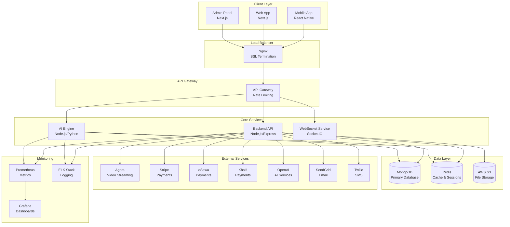
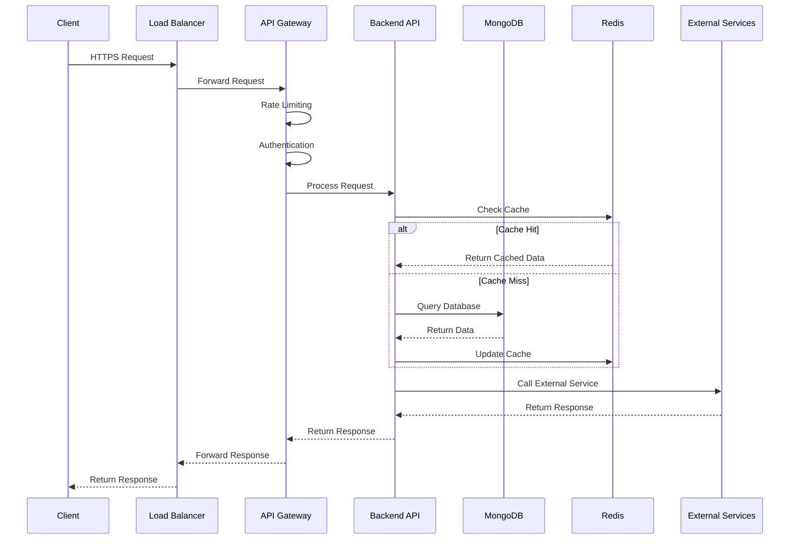
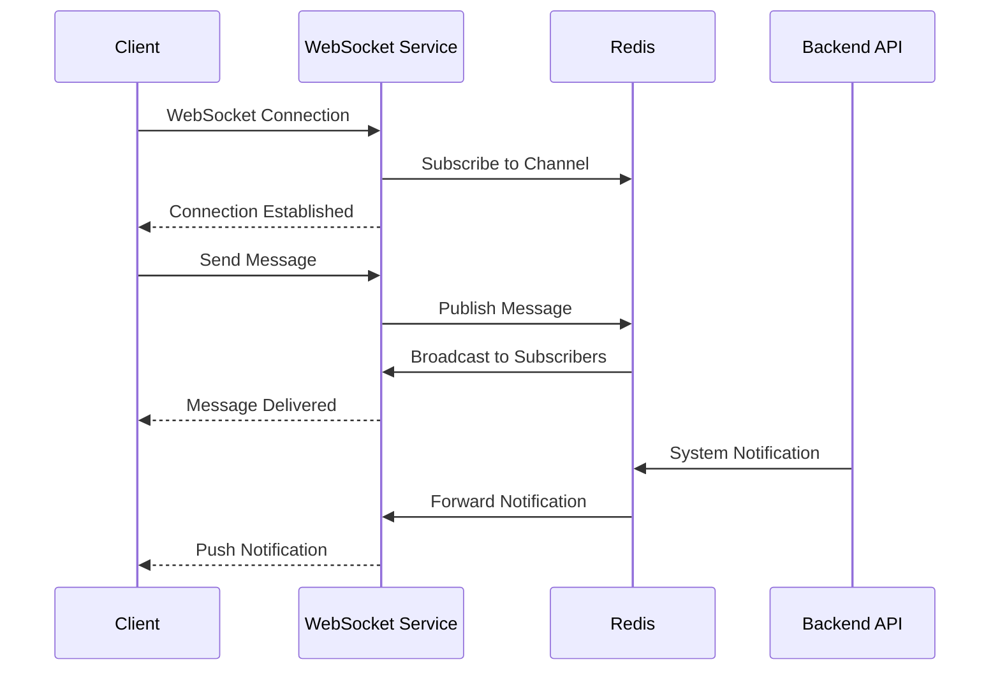
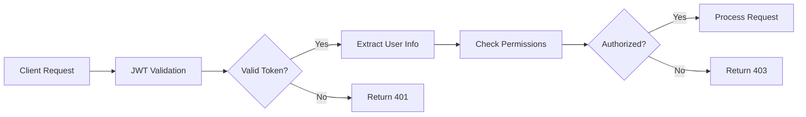
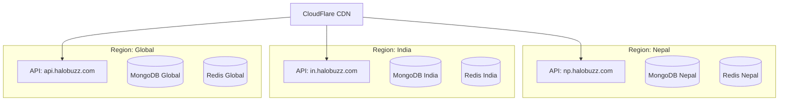
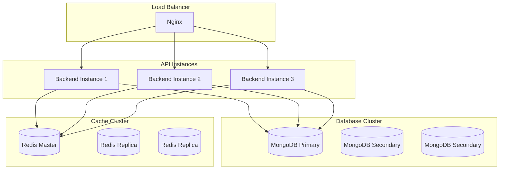
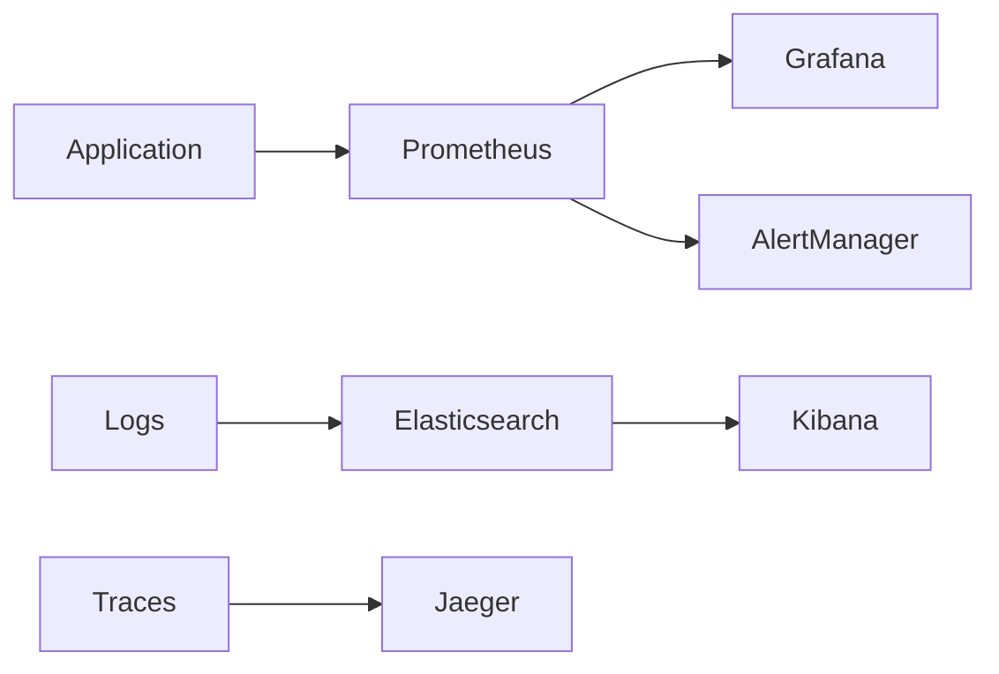
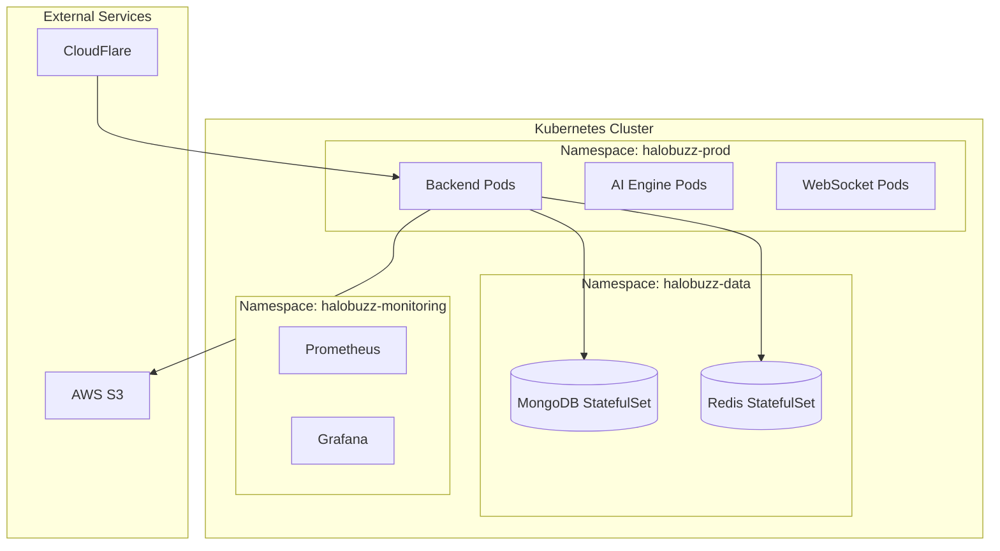
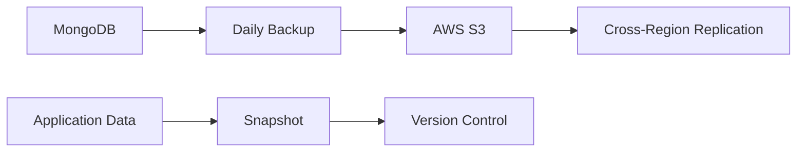
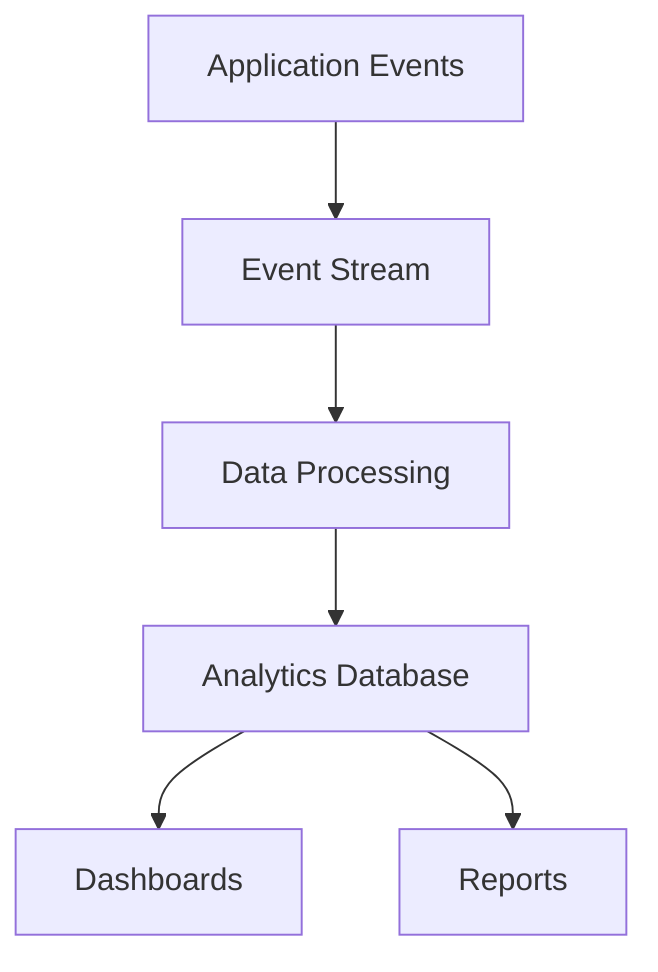

# HaloBuzz Platform Architecture v1.0

## 🏗️ System Overview

HaloBuzz is a comprehensive live streaming platform built with microservices architecture, designed for scalability, real-time performance, and global expansion. The platform supports multiple regions, currencies, and payment methods while maintaining high security and performance standards.

## 📊 High-Level Architecture



## 🔧 Component Architecture

### 1. Backend API Service (`backend/`)

**Purpose**: Core business logic, authentication, and API endpoints

**Technology Stack**:
- **Runtime**: Node.js 20.x
- **Framework**: Express.js
- **Language**: TypeScript
- **Database**: MongoDB with Mongoose ODM
- **Cache**: Redis
- **Authentication**: JWT with refresh tokens
- **File Storage**: AWS S3 with presigned URLs
- **Real-time**: Socket.IO with Redis adapter

**Key Components**:
```
backend/
├── src/
│   ├── config/          # Configuration management
│   ├── models/          # MongoDB schemas
│   ├── routes/          # API endpoints
│   ├── services/        # Business logic
│   ├── middleware/      # Express middleware
│   ├── utils/           # Utility functions
│   └── cron/            # Scheduled jobs
├── tests/               # Test suites
└── scripts/             # Build and deployment scripts
```

**Core Features**:
- User authentication and authorization
- Live streaming management
- Payment processing (Stripe, eSewa, Khalti, PayPal)
- Real-time chat and notifications
- Content moderation and AI services
- Creator economy and monetization
- Global expansion and localization
- Analytics and reporting

### 2. AI Engine Service (`ai-engine/`)

**Purpose**: AI-powered content analysis, moderation, and recommendations

**Technology Stack**:
- **Runtime**: Node.js 20.x
- **AI Services**: OpenAI GPT-3.5-turbo
- **Language**: TypeScript
- **Database**: MongoDB
- **Cache**: Redis

**Key Features**:
- Content moderation and safety
- Sentiment analysis
- Content quality assessment
- KYC verification
- Recommendation engine
- Automated content tagging

### 3. Mobile Application (`apps/halobuzz-mobile/`)

**Purpose**: Cross-platform mobile app for iOS and Android

**Technology Stack**:
- **Framework**: React Native with Expo
- **Navigation**: Expo Router
- **State Management**: Zustand
- **UI Components**: React Native Elements
- **Real-time**: Socket.IO client
- **Build**: EAS Build

**Key Features**:
- Live streaming viewer
- Real-time chat
- Social interactions (follow, like, share)
- Search and discovery
- Creator tools
- Payment integration
- Push notifications

### 4. Admin Panel (`admin/`)

**Purpose**: Administrative interface for platform management

**Technology Stack**:
- **Framework**: Next.js 14
- **Language**: TypeScript
- **Styling**: Tailwind CSS
- **UI Components**: Headless UI
- **Authentication**: NextAuth.js

**Key Features**:
- User management
- Content moderation
- Analytics dashboard
- Payment monitoring
- System configuration
- Security monitoring

## 🔄 Data Flow Architecture

### Request Processing Flow



### Real-time Communication Flow



## 🗄️ Data Architecture

### Database Schema

**MongoDB Collections**:

1. **Users**: User profiles, authentication, preferences
2. **LiveStreams**: Stream metadata, analytics, settings
3. **Messages**: Chat messages, moderation flags
4. **Transactions**: Payment records, coin transactions
5. **Gifts**: Virtual gifts, pricing, analytics
6. **ModerationFlags**: Content moderation, reports
7. **ReputationEvents**: User reputation tracking
8. **CreatorEconomy**: Creator tiers, subscriptions, brand deals
9. **SearchIndex**: Search optimization, trending content
10. **GlobalExpansion**: Regional settings, currencies, localization

### Caching Strategy

**Redis Usage**:
- **Session Storage**: User sessions and authentication tokens
- **API Response Cache**: Frequently accessed data (30min TTL)
- **Real-time Data**: Live stream viewers, chat messages
- **Rate Limiting**: Request throttling and abuse prevention
- **WebSocket State**: Connection management and message queuing

### File Storage

**AWS S3 Structure**:
```
halobuzz-storage/
├── avatars/           # User profile pictures
├── thumbnails/        # Stream thumbnails
├── recordings/        # Stream recordings
├── reels/            # Short video content
├── documents/        # KYC documents
└── temp/             # Temporary uploads
```

## 🔐 Security Architecture

### Authentication & Authorization



**Security Layers**:
1. **Transport Security**: HTTPS/TLS 1.3
2. **Authentication**: JWT with refresh tokens
3. **Authorization**: Role-based access control (RBAC)
4. **Rate Limiting**: Per-user and per-endpoint limits
5. **Input Validation**: Express-validator with sanitization
6. **CORS Protection**: Configurable origin restrictions
7. **Helmet.js**: Security headers
8. **Content Security Policy**: XSS protection

### Data Protection

- **Encryption at Rest**: MongoDB encryption, S3 server-side encryption
- **Encryption in Transit**: TLS for all communications
- **Password Security**: bcrypt with configurable rounds
- **PII Protection**: Data anonymization and retention policies
- **Audit Logging**: Comprehensive activity tracking

## 🌍 Global Expansion Architecture

### Multi-Region Support



**Regional Features**:
- **Currency Support**: NPR, INR, BDT, PKR, LKR, THB, VND, AED, USD
- **Payment Methods**: eSewa, Khalti, Paytm, PhonePe, bKash, Nagad
- **Localization**: 5+ languages with cultural adaptation
- **Timezone Support**: Regional timezone handling
- **Content Moderation**: Region-specific guidelines

## 📈 Scalability Architecture

### Horizontal Scaling



**Scaling Strategies**:
- **Stateless Services**: All API instances are stateless
- **Database Sharding**: User-based sharding strategy
- **Cache Distribution**: Redis Cluster for high availability
- **CDN Integration**: CloudFlare for global content delivery
- **Auto-scaling**: Kubernetes HPA based on CPU/memory metrics

## 🔍 Monitoring & Observability

### Metrics Collection



**Monitoring Stack**:
- **Metrics**: Prometheus + Grafana
- **Logging**: ELK Stack (Elasticsearch, Logstash, Kibana)
- **Tracing**: Jaeger for distributed tracing
- **Alerting**: AlertManager with Slack/email notifications
- **Health Checks**: Kubernetes liveness and readiness probes

**Key Metrics**:
- **Application**: Request rate, response time, error rate
- **Infrastructure**: CPU, memory, disk, network
- **Business**: User registrations, stream starts, payments
- **Security**: Failed logins, suspicious activity, rate limit hits

## 🚀 Deployment Architecture

### Production Environment



**Deployment Strategy**:
- **Container Orchestration**: Kubernetes
- **CI/CD**: GitHub Actions with automated testing
- **Infrastructure as Code**: Terraform for cloud resources
- **Secrets Management**: Kubernetes secrets with external vault
- **Backup Strategy**: Automated MongoDB backups to S3
- **Disaster Recovery**: Multi-region deployment with failover

## 🔧 Configuration Management

### Environment Configuration

**Configuration Hierarchy**:
1. **Default Values**: Hardcoded safe defaults
2. **Environment Variables**: Runtime configuration
3. **Config Files**: YAML/JSON configuration files
4. **Secrets Vault**: Encrypted secrets management
5. **Feature Flags**: Runtime feature toggles

**Configuration Validation**:
- **Startup Validation**: All required configs validated on startup
- **Type Safety**: TypeScript interfaces for all configurations
- **Secret Masking**: Sensitive data never logged
- **Environment Separation**: Dev/staging/production isolation

## 📋 API Design

### RESTful API Structure

```
/api/v1/
├── auth/              # Authentication endpoints
├── users/             # User management
├── streams/           # Live streaming
├── chat/              # Real-time chat
├── payments/          # Payment processing
├── gifts/             # Virtual gifts
├── moderation/        # Content moderation
├── analytics/         # Analytics and reporting
├── search/            # Global search
├── creator-economy/   # Creator monetization
├── global-expansion/  # Regional features
└── monitoring/        # Health and metrics
```

### WebSocket Events

```typescript
// Client to Server Events
'join_stream' | 'leave_stream' | 'send_message' | 'send_gift' | 'like_stream'

// Server to Client Events
'stream_started' | 'stream_ended' | 'new_message' | 'gift_received' | 'viewer_count_changed'
```

## 🎯 Performance Optimization

### Caching Strategy

- **API Response Cache**: 30-minute TTL for read-heavy endpoints
- **Database Query Cache**: Redis for expensive aggregations
- **CDN Caching**: Static assets cached globally
- **Browser Caching**: Optimized cache headers

### Database Optimization

- **Indexing Strategy**: Compound indexes for common queries
- **Query Optimization**: Aggregation pipelines for analytics
- **Connection Pooling**: Mongoose connection management
- **Read Replicas**: Separate read/write operations

### Real-time Optimization

- **WebSocket Scaling**: Redis adapter for multi-instance scaling
- **Message Batching**: Batch similar events to reduce overhead
- **Connection Management**: Automatic cleanup of stale connections
- **Rate Limiting**: Per-connection message limits

## 🔄 Backup & Recovery

### Backup Strategy



**Backup Schedule**:
- **Database**: Daily automated backups with 30-day retention
- **File Storage**: S3 versioning with lifecycle policies
- **Configuration**: Git-based version control
- **Disaster Recovery**: Multi-region backup replication

## 📊 Business Intelligence

### Analytics Architecture



**Analytics Features**:
- **Real-time Metrics**: Live user activity and engagement
- **Business Metrics**: Revenue, user growth, content performance
- **Predictive Analytics**: User behavior and content recommendations
- **Custom Dashboards**: Configurable analytics for different roles

---

## 🚀 Getting Started

### Prerequisites

- Node.js 20.x
- MongoDB 7.x
- Redis 7.x
- Docker & Docker Compose
- AWS CLI (for S3)

### Quick Start

```bash
# Clone repository
git clone https://github.com/halobuzz/halobuzz-platform.git
cd halobuzz-platform

# Setup environment
make setup

# Start development
make up

# Run tests
make test

# Build for production
make build
```

### Production Deployment

```bash
# Deploy to production
make deploy-prod

# Monitor services
make monitor

# Check health
make health
```

---

This architecture document provides a comprehensive overview of the HaloBuzz platform's design, implementation, and operational considerations. For detailed implementation guides, refer to the individual service documentation and runbooks.
