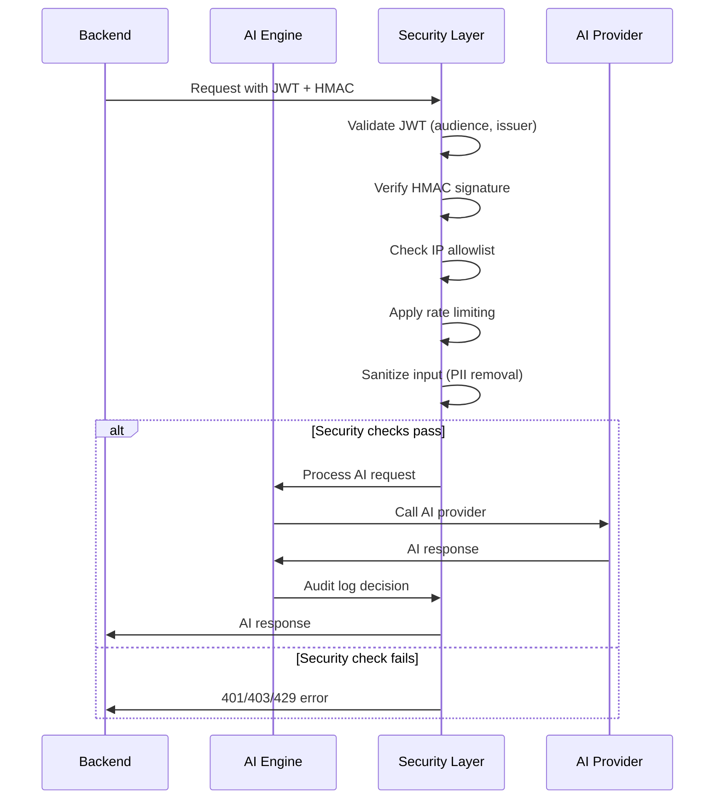
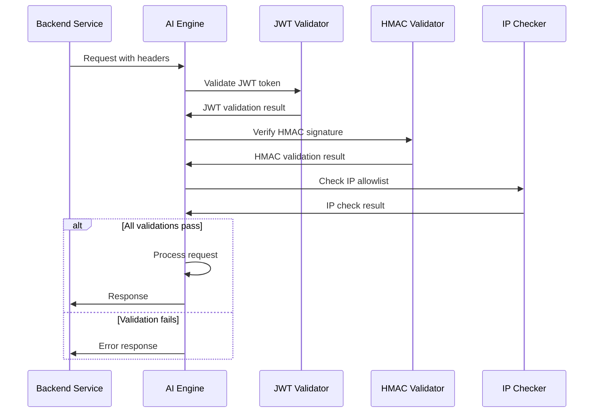

# AI Engine Gate Analysis

## Executive Summary
- **AI Engine Status**: ✅ **Production-Ready** with comprehensive security
- **Authentication**: ✅ **Multi-layer** (JWT + HMAC + IP allowlist)
- **Rate Limiting**: ✅ **100 requests/minute** per IP
- **Security**: ✅ **Hardened** with PII sanitization and audit logging
- **Endpoints**: 3 internal services + 4 public AI features
- **Missing**: External AI provider integration, advanced monitoring

## AI Engine Architecture

### 🤖 **Service Overview** (`ai-engine/src/index.ts`)
**Status**: ✅ **Fully Implemented**
**Size**: 244 lines
**Port**: 4000 (configurable)
**Environment**: Production-ready with security hardening

**Key Features**:
- Express.js server with Socket.IO integration
- Comprehensive security middleware stack
- Health check endpoints
- Graceful shutdown handling
- Service initialization and logging

### 🔐 **Security Implementation**

#### **Multi-Layer Authentication**
1. **JWT Validation** (`validateServiceJWT`)
   - Audience verification (`aud: 'ai-engine'`)
   - Issuer verification (`iss: 'halobuzz-backend'`)
   - Token expiration handling
   - Service secret validation

2. **HMAC Signature** (`validateHMACSignature`)
   - SHA-256 HMAC verification
   - Timestamp validation (5-minute tolerance)
   - Replay attack prevention
   - Timing-safe comparison

3. **IP Allowlist** (`internalIPAllowlist`)
   - Backend IP restrictions
   - Development localhost access
   - Railway environment support
   - CIDR notation support

#### **Rate Limiting** (`internalAPILimiter`)
- 100 requests per minute per IP
- Standard rate limit headers
- Comprehensive logging
- 429 status responses

#### **Input Sanitization** (`sanitizeAIInput`)
- PII pattern removal (emails, phones, cards)
- Control character filtering
- Recursive object sanitization
- Null byte removal

#### **Security Headers** (`aiSecurityHeaders`)
- Content Security Policy (strict)
- HSTS with preload
- XSS protection
- Frame options (DENY)
- Service identification

## AI Service Endpoints

### 🛡️ **Internal Services** (Protected Routes)

#### **Moderation Service** (`/internal/moderation/*`)
**Authentication**: JWT + HMAC + IP allowlist
**Rate Limit**: 100 req/min
**Features**:
- NSFW content scanning
- Age estimation from face frames
- Real-time profanity detection
- Policy enforcement
- Threshold management

**Endpoints**:
- `POST /nsfw-scan` - Video/stream NSFW detection
- `POST /age-estimate` - Face age estimation
- `POST /profanity-check` - Audio profanity detection
- `POST /policy-enforce` - Policy-based moderation
- `POST /process` - Generic moderation processor
- `GET/PUT /thresholds` - Warning threshold management
- `GET /health` - Service health check

#### **Engagement Service** (`/internal/engagement/*`)
**Authentication**: AI Engine secret + rate limiting
**Features**:
- Boredom detection from viewer events
- Cohost suggestion algorithm
- Festival skin recommendations
- Battle boost triggering

**Endpoints**:
- `POST /boredom-detector` - Viewer engagement analysis
- `POST /cohost-suggester` - Cohost recommendations
- `POST /festival-skinner` - Festival theme suggestions
- `POST /battle-boost` - Stream battle enhancement
- `POST /process` - Generic engagement processor
- `GET/PUT /thresholds` - Boredom threshold management
- `GET /health` - Service health check

#### **Reputation Service** (`/internal/reputation/*`)
**Authentication**: JWT + HMAC + IP allowlist
**Features**:
- Reputation event processing
- User permission checking
- Bulk event handling
- Configuration management

**Endpoints**:
- `POST /event` - Single reputation event
- `POST /bulk-events` - Batch event processing
- `GET /score/:userId` - User reputation score
- `GET /permissions/:userId` - User permission check
- `GET /events/:userId` - User event history
- `GET/PUT /configuration` - System configuration
- `GET /statistics` - System statistics
- `GET /health` - Service health check

### 🌟 **Public AI Features** (Open Routes)

#### **Recommendation Engine** (`/api/ai/recommendation/*`)
- Content recommendations
- User preference learning
- Collaborative filtering

#### **Enhancement Service** (`/api/ai/enhancement/*`)
- Content enhancement
- Quality improvement
- Feature extraction

#### **Conversation AI** (`/api/ai/conversation/*`)
- Chat assistance
- Natural language processing
- Context understanding

#### **AR Features** (`/api/ai/ar/*`)
- Augmented reality processing
- Object detection
- AR content generation

## Security Architecture

### Request Flow Security


### Authentication Flow


## Configuration

### Environment Variables
```bash
# AI Engine Configuration
AI_SERVICE_SECRET=your-ai-service-secret
INTERNAL_API_SECRET_KEY=your-internal-api-key
ALLOWED_BACKEND_IPS=127.0.0.1,10.0.0.0/8,172.16.0.0/12

# Service URLs
BACKEND_URL=http://localhost:3000
PORT=4000
NODE_ENV=production

# Railway Configuration
RAILWAY_ENVIRONMENT=true
```

### Security Configuration
```typescript
{
  rateLimit: {
    windowMs: 60000,        // 1 minute
    max: 100,               // 100 requests per window
    standardHeaders: true,
    legacyHeaders: false
  },
  hmac: {
    algorithm: 'sha256',
    tolerance: 300,         // 5 minutes
    timingSafe: true
  },
  jwt: {
    audience: 'ai-engine',
    issuer: 'halobuzz-backend',
    required: true
  },
  csp: {
    strict: true,
    allowNone: true
  }
}
```

## AI Service Integration

### ✅ **Well Integrated**
- Backend service communication
- Socket.IO real-time events
- Comprehensive logging
- Error handling
- Health monitoring

### ❌ **Missing Integration**
- External AI provider APIs (OpenAI, Anthropic, etc.)
- AI model management
- Response caching
- Performance monitoring
- Cost tracking

## Socket.IO Integration

### ✅ **Real-time Features**
- AI warning event broadcasting
- Moderation service integration
- Client connection management
- Event logging

**Events**:
- `ai:warning` - AI moderation warnings
- Connection/disconnection handling
- Service status broadcasting

## Monitoring & Observability

### ✅ **Implemented**
- Request/response logging
- Error tracking
- Health check endpoints
- Audit logging for AI decisions
- Performance metrics

### ❌ **Missing**
- AI provider cost tracking
- Response time monitoring
- AI accuracy metrics
- Usage analytics
- Alerting system

## Testing

### ✅ **Implemented Tests**
- Security middleware tests
- Authentication tests
- Rate limiting tests
- Input sanitization tests

### ❌ **Missing Tests**
- AI service integration tests
- End-to-end AI workflow tests
- Performance tests
- Load testing

## Performance Considerations

### ✅ **Optimized**
- Efficient middleware stack
- Input sanitization
- Rate limiting
- Error handling

### ⚠️ **Could Be Improved**
- AI response caching
- Async processing
- Connection pooling
- Memory management

## Missing Features

### ❌ **External AI Integration**
**Impact**: High - No actual AI processing capability
**Missing**:
- OpenAI API integration
- Anthropic Claude integration
- Custom model deployment
- AI provider failover

### ❌ **Advanced Monitoring**
**Impact**: Medium - Limited observability
**Missing**:
- AI cost tracking
- Response time monitoring
- Accuracy metrics
- Usage dashboards

### ❌ **Model Management**
**Impact**: Medium - No model versioning
**Missing**:
- Model versioning
- A/B testing
- Model performance tracking
- Rollback capabilities

### ❌ **Response Caching**
**Impact**: Low - Performance optimization
**Missing**:
- AI response caching
- Cache invalidation
- Cache warming
- Performance optimization

## Business Logic

### ✅ **Correct Implementation**
- Security middleware stack
- Authentication flows
- Rate limiting logic
- Input sanitization

### ⚠️ **Needs Implementation**
- AI provider integration
- Model selection logic
- Response processing
- Error handling for AI failures

## Next Steps

### **High Priority**
1. Integrate external AI providers (OpenAI, Anthropic)
2. Implement AI response caching
3. Add AI cost tracking and monitoring
4. Create AI model management system

### **Medium Priority**
1. Add advanced monitoring and alerting
2. Implement AI response optimization
3. Create AI usage analytics
4. Add AI model versioning

### **Low Priority**
1. Implement AI A/B testing
2. Add AI performance optimization
3. Create AI model rollback system
4. Implement advanced AI features
