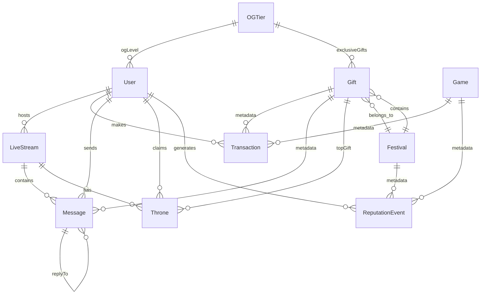

# Data Model Map

## Executive Summary
- **Total Models**: 14+ MongoDB models identified
- **Relationships**: Complex interconnected schema with proper references
- **Indexes**: Well-indexed for performance
- **Status**: ✅ **Well-designed** with comprehensive features
- **Issues**: Some TypeScript compatibility issues with Mongoose 8.x

## Core Models Analysis

### 👤 User Model (`User.ts`)
**Status**: ✅ **Comprehensive**
**Size**: 428 lines
**Key Features**:
- Complete user profile with social login support
- Trust score system with multiple factors
- Karma system with Nepali cultural integration
- OG tier integration
- KYC and age verification
- Device binding and 2FA support
- Comprehensive preferences and privacy settings

**Relationships**:
- `hostId` → LiveStream (1:many)
- `userId` → Transaction (1:many)
- `userId` → Message (1:many)
- `userId` → Throne (1:many)
- `userId` → ReputationEvent (1:many)

**Indexes**: 9 indexes including unique constraints
**Virtual Fields**: age, isOGActive, isHaloThroneActive
**Methods**: comparePassword, findByCountry, findTopCreators

### 📺 LiveStream Model (`LiveStream.ts`)
**Status**: ✅ **Feature-rich**
**Size**: 410 lines
**Key Features**:
- Agora integration for live streaming
- Comprehensive analytics and metrics
- AI suggestions and moderation
- Viewer management and engagement tracking
- Stream settings and permissions
- Recording and thumbnail support

**Relationships**:
- `hostId` → User (many:1)
- `roomId` → Message (1:many)
- `streamId` → Throne (1:many)

**Indexes**: 8 indexes for performance
**Methods**: startStream, endStream, addViewer, addGift, addLike, etc.
**Static Methods**: findByCategory, findTrending, findByCountry

### 🎁 Gift Model (`Gift.ts`)
**Status**: ✅ **Well-structured**
**Size**: 173 lines
**Key Features**:
- Rarity system (common, rare, epic, legendary)
- Festival integration
- OG tier requirements
- Limited quantity support
- Effects and animations
- Popularity tracking

**Relationships**:
- `festivalId` → Festival (many:1)
- `giftId` → Transaction metadata
- `giftId` → Message metadata

**Indexes**: 6 indexes for filtering and sorting
**Methods**: incrementSent
**Static Methods**: findByPriceRange, findByCategory, findPopular

### 💰 Transaction Model (`Transaction.ts`)
**Status**: ✅ **Payment-focused**
**Size**: 139 lines
**Key Features**:
- Multiple payment methods (eSewa, Khalti, Stripe)
- Comprehensive transaction types
- Fee calculation and net amount
- Metadata for different transaction contexts
- Status tracking

**Relationships**:
- `userId` → User (many:1)
- `metadata.giftId` → Gift
- `metadata.streamId` → LiveStream

**Indexes**: 6 indexes including unique transaction ID
**Methods**: Auto-calculates netAmount
**Static Methods**: findUserTransactions, findByType, getSummary

### 👑 OGTier Model (`OGTier.ts`)
**Status**: ✅ **Subscription system**
**Size**: 135 lines
**Key Features**:
- 5-tier subscription system
- Comprehensive benefits structure
- Dual pricing (USD/coins)
- Duration-based subscriptions
- Exclusive gifts and privileges

**Relationships**:
- `exclusiveGifts` → Gift (many:many)
- Referenced by User.ogLevel

**Indexes**: 4 indexes for tier management
**Static Methods**: findActive, findByTier, findNextTier

### 🎮 Game Model (`Game.ts`)
**Status**: ✅ **Gaming system**
**Size**: 156 lines
**Key Features**:
- Multiple game types (battle, quiz, lottery, challenge)
- AI win rate enforcement (35-55%)
- Player limits and entry fees
- Prize pool management
- Comprehensive metadata tracking

**Relationships**:
- `gameId` → Transaction metadata
- `gameId` → ReputationEvent metadata

**Indexes**: 5 indexes for game discovery
**Methods**: startGame, endGame
**Static Methods**: findActive, findByType, findPopular

### 🎉 Festival Model (`Festival.ts`)
**Status**: ✅ **Cultural integration**
**Size**: 223 lines
**Key Features**:
- Cultural and seasonal festivals
- Theme customization
- Gift and skin collections
- Bonus multipliers
- Challenge system
- Participation tracking

**Relationships**:
- `gifts` → Gift (many:many)
- `festivalId` → Gift.festivalId

**Indexes**: 5 indexes for festival management
**Methods**: activate, deactivate, updateMetadata
**Static Methods**: findActive, findUpcoming, findByType, findPopular

### 💬 Message Model (`Message.ts`)
**Status**: ✅ **Chat system**
**Size**: 168 lines
**Key Features**:
- Room-based messaging
- Multiple message types (text, gift, system, emoji)
- Soft deletion with moderation
- Mention extraction
- Reply threading
- OG level display

**Relationships**:
- `roomId` → LiveStream (many:1)
- `userId` → User (many:1)
- `replyTo` → Message (self-reference)
- `metadata.giftId` → Gift

**Indexes**: 5 indexes for chat performance
**Methods**: softDelete
**Static Methods**: findByRoom, findByUser, findWithMentions, findGiftMessages

### 🏆 Throne Model (`Throne.ts`)
**Status**: ✅ **Competition system**
**Size**: 161 lines
**Key Features**:
- Stream-based throne competition
- Time-limited sessions
- Gift tracking and leaderboards
- Metadata for top gifts and unique gifters
- Claim system

**Relationships**:
- `streamId` → LiveStream (many:1)
- `userId` → User (many:1)
- `metadata.topGift.giftId` → Gift

**Indexes**: 6 indexes for throne management
**Methods**: claim, addGift
**Static Methods**: findActiveForStream, findExpired, findUserHistory, findTopThrones

### 📊 ReputationEvent Model (`ReputationEvent.ts`)
**Status**: ✅ **Reputation system**
**Size**: 206 lines
**Key Features**:
- Comprehensive event types (20+ types)
- Dual reputation and karma systems
- Cultural integration with Nepali translations
- Wellness and community support tracking
- Detailed metadata for different event types

**Relationships**:
- `userId` → User (many:1)
- `metadata.giftId` → Gift
- `metadata.streamId` → LiveStream
- `metadata.gameId` → Game

**Indexes**: 7 indexes for reputation queries
**Static Methods**: findByUser, findByType, getUserSummary, getTotalReputation, findKarmaByCategory, findCulturalEvents

## Model Relationships Diagram

## Index Analysis

### ✅ **Well-Indexed Models**
- **User**: 9 indexes including unique constraints and performance indexes
- **LiveStream**: 8 indexes for streaming queries
- **Transaction**: 6 indexes including unique transaction ID
- **Gift**: 6 indexes for filtering and popularity
- **Message**: 5 indexes for chat performance
- **Throne**: 6 indexes for competition queries
- **ReputationEvent**: 7 indexes for reputation queries

### ⚠️ **Could Use More Indexes**
- **Game**: 5 indexes (could add more for complex queries)
- **Festival**: 5 indexes (could add more for date-based queries)
- **OGTier**: 4 indexes (could add more for benefit queries)

## Schema Design Quality

### ✅ **Strengths**
1. **Comprehensive Relationships**: Proper foreign key references
2. **Rich Metadata**: Flexible metadata fields for different contexts
3. **Cultural Integration**: Nepali language support and cultural events
4. **Performance Optimization**: Well-designed indexes
5. **Business Logic**: Methods and static methods for common operations
6. **Validation**: Proper field validation and constraints
7. **Soft Deletion**: Implemented where appropriate (Message model)
8. **Audit Trail**: Timestamps on all models

### ⚠️ **Areas for Improvement**
1. **TypeScript Compatibility**: Some Mongoose 8.x type issues
2. **Schema Versioning**: No versioning strategy for schema changes
3. **Data Archiving**: No archiving strategy for old data
4. **Cascade Deletes**: No cascade delete rules defined
5. **Data Validation**: Could use more complex validation rules

## Missing Models (Referenced but Not Found)

### ❌ **Expected but Missing**
- **ModerationFlag**: Referenced in admin routes
- **WebhookEvent**: Referenced in payment routes
- **AdminAudit**: Referenced in admin routes
- **GamingSession**: Referenced in gaming controls
- **SocketSession**: Referenced in socket security
- **CronJob**: Referenced in cron security
- **FeatureFlag**: Referenced in config routes

## Data Integrity

### ✅ **Well Maintained**
- Unique constraints on critical fields
- Proper foreign key relationships
- Enum validations for status fields
- Required field validations
- Min/max constraints on numeric fields

### ⚠️ **Potential Issues**
- No cascade delete rules
- No data archiving strategy
- No schema migration system
- Some optional fields that might need defaults

## Performance Considerations

### ✅ **Optimized**
- Composite indexes for common query patterns
- Sparse indexes for optional fields
- Proper field selection in queries
- Aggregation pipelines for complex queries

### ⚠️ **Could Be Improved**
- No connection pooling configuration visible
- No query optimization hints
- No data partitioning strategy
- No caching layer integration

## Next Steps

### **High Priority**
1. Fix TypeScript compatibility issues with Mongoose 8.x
2. Create missing models (ModerationFlag, WebhookEvent, etc.)
3. Implement schema versioning strategy
4. Add cascade delete rules where appropriate

### **Medium Priority**
1. Add more comprehensive validation rules
2. Implement data archiving strategy
3. Add query optimization hints
4. Create schema migration system

### **Low Priority**
1. Add more indexes for complex queries
2. Implement data partitioning
3. Add caching layer integration
4. Create data backup and recovery strategy
