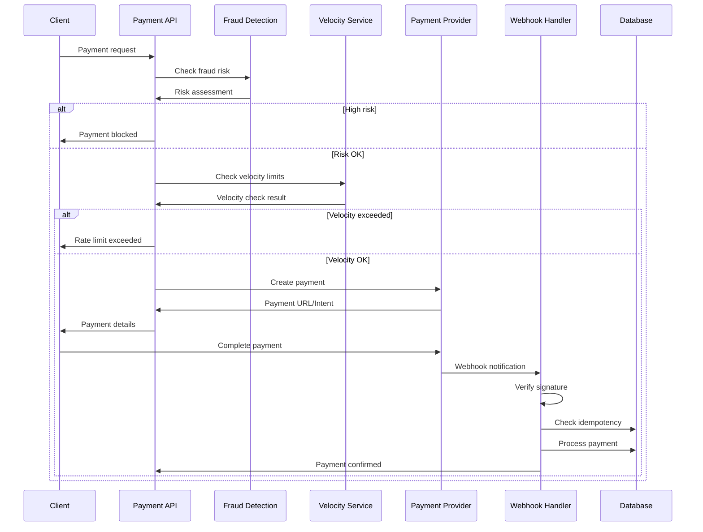
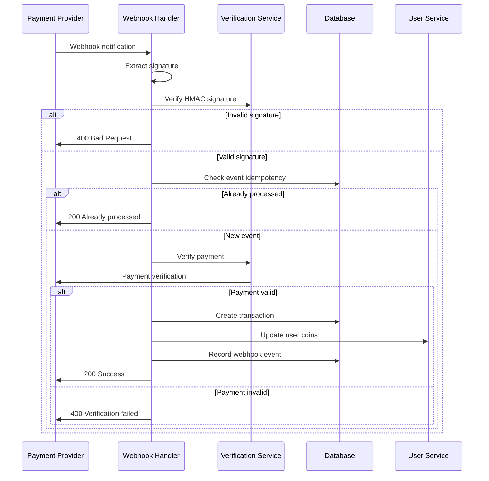

# Payments & Webhooks System

## Executive Summary
- **Payment Providers**: 3 providers (Stripe, eSewa, Khalti)
- **Webhook Security**: ✅ **Well-secured** with HMAC verification and idempotency
- **Fraud Detection**: ✅ **Advanced** with velocity controls and risk scoring
- **Status**: ✅ **Production-ready** with comprehensive error handling
- **Missing**: Refund handling, dispute management, advanced analytics

## Payment Providers

### 💳 **Stripe Integration** (`PaymentService.ts`)
**Status**: ✅ **Fully Implemented**
**Features**:
- Payment Intent creation
- Webhook event handling
- Automatic payment method detection
- USD currency support
- Metadata tracking

**Webhook Events**:
- `payment_intent.succeeded` - Process successful payments
- `payment_intent.payment_failed` - Handle failed payments
- Signature verification with Stripe SDK
- Idempotency by Stripe event ID

### 🇳🇵 **eSewa Integration** (Nepal)
**Status**: ✅ **Fully Implemented**
**Features**:
- Payment URL generation
- HMAC signature verification
- NPR currency support
- Success/failure callback URLs
- Transaction verification

**Security**:
- HMAC-SHA256 signature verification
- Idempotency by reference ID (`rid`)
- Webhook event tracking

### 🇳🇵 **Khalti Integration** (Nepal)
**Status**: ✅ **Fully Implemented**
**Features**:
- Payment initiation API
- Token-based verification
- NPR currency support (paisa conversion)
- Customer information handling
- Payment lookup API

**Security**:
- HMAC-SHA256 signature verification
- Idempotency by payment token
- Webhook event tracking

## Webhook Security Implementation

### ✅ **HMAC Verification**
**All Providers**:
- SHA-256 HMAC signature validation
- Secret key-based verification
- Raw body processing for signature calculation
- Invalid signature rejection (400 status)

### ✅ **Idempotency Protection**
**Implementation**:
- Unique event IDs per provider
- Database-based duplicate detection
- WebhookEvent model tracking
- "Already processed" responses

**Event ID Formats**:
- Stripe: `stripe:${event.id}`
- eSewa: `esewa:${rid}`
- Khalti: `khalti:${token}`

### ✅ **Webhook Event Model** (`WebhookEvent.ts`)
**Schema**:
```typescript
{
  eventId: string (unique),
  source: 'esewa' | 'khalti' | 'stripe',
  signature?: string,
  payloadHash?: string,
  processedAt: Date,
  createdAt: Date,
  updatedAt: Date
}
```

## Fraud Detection System

### ✅ **PaymentFraudService** (`PaymentFraudService.ts`)
**Status**: ✅ **Advanced Implementation**
**Size**: 311+ lines

**Risk Assessment Features**:
- Multi-factor risk scoring (0-100)
- Velocity limit checking
- Device trust scoring
- User payment history analysis
- IP reputation assessment
- Amount-based risk factors

**Risk Thresholds**:
- Low: 0-29
- Medium: 30-49
- High: 50-69
- Critical: 70-100

### ✅ **Velocity Controls** (`PaymentVelocityService.ts`)
**Limits**:
- Max 10 recharges per hour
- Max 10,000 coins per day
- Max 5 failures per hour
- Max 5,000 coins losses per day

**Controls**:
- User-based limits
- Device-based limits
- IP-based limits
- Time-window tracking

### ✅ **Fraud Detection Models**
**Database Schemas**:
1. **FraudEvent** - Fraud event logging
2. **DeviceFingerprint** - Device trust scoring
3. **VelocityControl** - Rate limiting tracking
4. **TransactionReview** - Manual review queue

## Payment Flow Architecture

### Payment Processing Flow


### Webhook Processing Flow


## Transaction Management

### ✅ **Transaction Model** (`Transaction.ts`)
**Fields**:
- User ID and payment method
- Amount, currency, and status
- Payment provider and transaction ID
- Reference ID and metadata
- Net amount and fees
- Timestamps and descriptions

### ✅ **Transaction Types**
- `recharge` - Coin purchases
- `og_bonus` - OG tier bonuses
- `gift_sent` - Gift transactions
- `withdrawal` - Coin withdrawals

### ✅ **Transaction Statuses**
- `pending` - Awaiting payment
- `completed` - Successfully processed
- `failed` - Payment failed
- `cancelled` - User cancelled
- `refunded` - Payment refunded

## Security Features

### ✅ **Comprehensive Security**
- HMAC signature verification
- Idempotency protection
- Rate limiting and velocity controls
- Fraud detection and risk scoring
- Device fingerprinting
- IP-based tracking
- Transaction review system

### ✅ **Error Handling**
- Graceful webhook failures
- Comprehensive logging
- Retry mechanisms
- Timeout handling
- Invalid signature rejection

## Missing Features

### ❌ **Refund Management**
**Impact**: High - No refund processing capability
**Missing**:
- Refund API endpoints
- Refund webhook handling
- Refund status tracking
- Partial refund support

### ❌ **Dispute Management**
**Impact**: Medium - No chargeback handling
**Missing**:
- Dispute webhook handling
- Dispute status tracking
- Dispute resolution workflow
- Evidence submission

### ❌ **Advanced Analytics**
**Impact**: Medium - Limited payment insights
**Missing**:
- Payment success rates
- Provider performance metrics
- Fraud detection analytics
- Revenue reporting

### ❌ **Multi-Currency Support**
**Impact**: Low - Limited currency options
**Missing**:
- Dynamic currency conversion
- Multi-currency transactions
- Currency-specific pricing
- Exchange rate management

## Configuration

### Environment Variables
```bash
# Stripe
STRIPE_SECRET_KEY=sk_test_...
STRIPE_WEBHOOK_SECRET=whsec_...

# eSewa
ESEWA_MERCHANT_ID=your_merchant_id
ESEWA_SECRET_KEY=your_secret_key
ESEWA_WEBHOOK_SECRET=your_webhook_secret

# Khalti
KHALTI_PUBLIC_KEY=pk_test_...
KHALTI_SECRET_KEY=sk_test_...
KHALTI_WEBHOOK_SECRET=your_webhook_secret

# Base URL
BASE_URL=https://your-domain.com
```

### Fraud Detection Configuration
```typescript
{
  maxRechargesHr: 10,
  maxCoinsPerDay: 10000,
  maxFailuresHr: 5,
  maxLossesPerDay: 5000,
  highRiskThreshold: 70,
  reviewThreshold: 50
}
```

## Testing

### ✅ **Implemented Tests**
- Payment security tests
- Webhook signature verification
- Fraud detection tests
- Velocity control tests

### ❌ **Missing Tests**
- End-to-end payment flows
- Webhook retry mechanisms
- Refund processing tests
- Multi-provider integration tests

## Performance Considerations

### ✅ **Optimized**
- Database indexing on transaction fields
- Efficient webhook processing
- Cached fraud detection results
- Batch transaction processing

### ⚠️ **Could Be Improved**
- Webhook processing queue
- Async payment verification
- Database connection pooling
- Payment analytics caching

## Integration Points

### ✅ **Well Integrated**
- User management system
- Coin balance updates
- Transaction logging
- Fraud detection system
- Security middleware

### ⚠️ **Needs Integration**
- Notification system
- Analytics dashboard
- Admin panel
- Customer support tools

## Business Logic

### ✅ **Correct Implementation**
- Coin conversion rates
- Payment provider routing
- Fraud detection algorithms
- Velocity control logic
- Webhook idempotency

### ⚠️ **Needs Validation**
- Currency conversion accuracy
- Provider fee calculations
- Risk scoring algorithms
- Velocity limit effectiveness

## Next Steps

### **High Priority**
1. Implement refund management system
2. Add dispute handling capabilities
3. Create payment analytics dashboard
4. Implement webhook retry mechanisms

### **Medium Priority**
1. Add multi-currency support
2. Implement advanced fraud detection
3. Create payment monitoring tools
4. Add automated testing suite

### **Low Priority**
1. Implement payment optimization
2. Add A/B testing for payment flows
3. Create payment performance metrics
4. Implement advanced reporting
