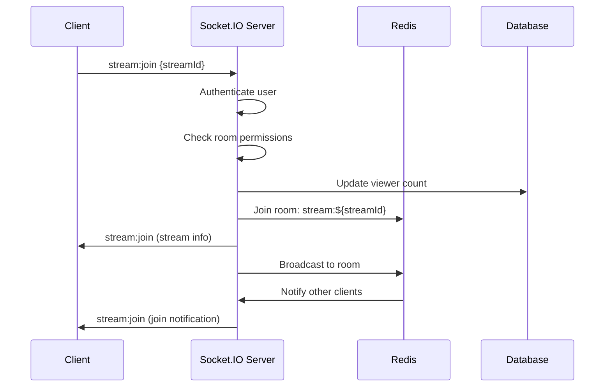
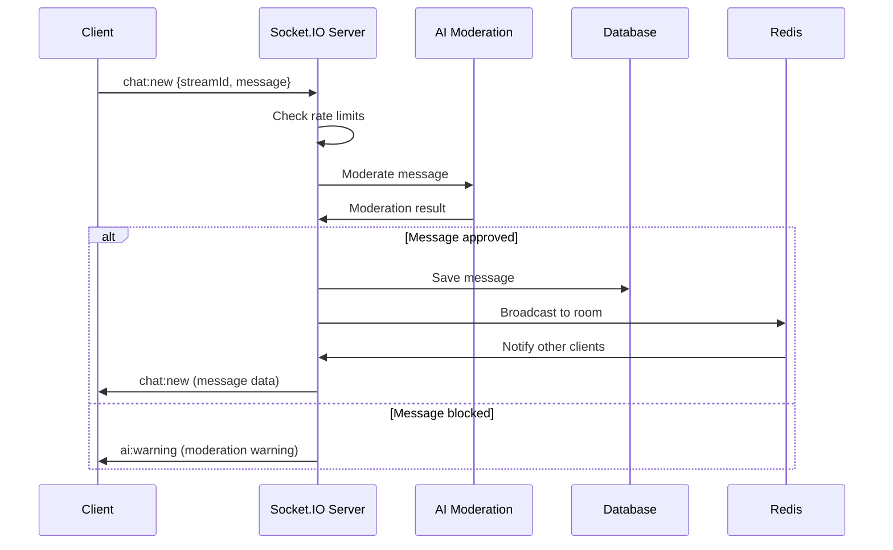

# Real-time Features Map

## Executive Summary
- **Socket.IO Implementation**: ✅ **Comprehensive** with Redis adapter
- **Event Types**: 8 canonical event types implemented
- **Security**: ✅ **Well-secured** with authentication and rate limiting
- **Scaling**: ✅ **Multi-instance ready** with Redis pub/sub
- **Status**: ✅ **Production-ready** with proper error handling

## Socket.IO Architecture

### 🔧 **Server Configuration** (`backend/src/config/socket.ts`)
**Status**: ✅ **Fully Implemented**
**Size**: 475 lines
**Key Features**:
- JWT-based authentication middleware
- Redis adapter for multi-instance scaling
- Comprehensive security controls
- Error handling and logging
- Room-based messaging system

### 📱 **Client Implementation** (`mobile/src/services/socketService.ts`)
**Status**: ✅ **Well-structured**
**Size**: 180 lines
**Key Features**:
- Automatic reconnection with exponential backoff
- Event listener management
- Canonical event emitters
- Connection state management

## Event System Architecture

### 🎯 **Canonical Events** (8 core events)

#### 1. **Stream Events**
- `stream:join` - Join live stream room
- `stream:leave` - Leave live stream room

#### 2. **Chat Events**
- `chat:new` - Send/receive chat messages

#### 3. **Gift Events**
- `gift:sent` - Send/receive virtual gifts

#### 4. **Throne Events**
- `throne:claimed` - Claim stream throne

#### 5. **Battle Events**
- `battle:boost` - Send battle boosts

#### 6. **AI Events**
- `ai:warning` - AI moderation warnings

#### 7. **OG Events**
- `og:changed` - OG tier level changes

#### 8. **Metrics Events**
- `metrics:update` - Stream metrics updates

## Room System

### 🏠 **Room Types**
1. **User Rooms**: `user:${userId}` - Personal user notifications
2. **Stream Rooms**: `stream:${streamId}` - Live stream participants
3. **Throne Rooms**: `throne:${streamId}` - Throne competition participants
4. **Collaboration Rooms**: `collab:${sessionId}` - Collaborative content sessions

### 🔐 **Room Security**
- Authentication required for all rooms
- Rate limiting per user and room
- Permission-based access control
- Automatic cleanup on disconnect

## Security Implementation

### ✅ **Authentication & Authorization**
- JWT token validation on connection
- User data caching for performance
- Socket-level user identification
- Permission-based room access

### ✅ **Rate Limiting & Controls**
- Connection limits per user
- Message rate limiting
- Room join/leave tracking
- Violation detection and handling

### ✅ **Content Moderation**
- AI-powered message moderation
- Real-time content filtering
- Warning and ban systems
- Moderation score tracking

## Real-time Features by Category

### 📺 **Live Streaming**
**Status**: ✅ **Fully Implemented**
- Real-time viewer count updates
- Stream join/leave notifications
- Stream metrics broadcasting
- Throne competition system
- Battle boost system

**Events**:
- `stream:join` - User joins stream
- `stream:leave` - User leaves stream
- `metrics:update` - Stream metrics update
- `throne:claimed` - Throne competition
- `battle:boost` - Battle system

### 💬 **Chat System**
**Status**: ✅ **Fully Implemented**
- Real-time message broadcasting
- AI content moderation
- Message types (text, gift, system, emoji)
- Mention extraction
- Reply threading

**Events**:
- `chat:new` - New chat message
- `ai:warning` - Moderation warnings

### 🎁 **Gift System**
**Status**: ✅ **Fully Implemented**
- Real-time gift animations
- Gift transaction processing
- Throne competition integration
- Gift statistics tracking

**Events**:
- `gift:sent` - Gift sent to stream

### 👑 **OG System**
**Status**: ✅ **Fully Implemented**
- Real-time OG level changes
- OG benefit notifications
- Tier upgrade broadcasting

**Events**:
- `og:changed` - OG tier level change

### 🤝 **Collaboration System**
**Status**: ✅ **Partially Implemented**
- Real-time collaborative editing
- Session management
- Permission-based access
- Edit conflict resolution

**Events**:
- `content_updated` - Collaborative content update

## Performance & Scaling

### ✅ **Redis Integration**
- Redis adapter for multi-instance scaling
- Pub/sub for cross-instance communication
- Connection state persistence
- Automatic failover support

### ✅ **Connection Management**
- Automatic reconnection with backoff
- Connection state tracking
- Graceful disconnection handling
- Resource cleanup on disconnect

### ✅ **Error Handling**
- Comprehensive error logging
- Graceful error recovery
- User-friendly error messages
- Connection error handling

## Event Flow Diagrams

### Stream Join Flow

### Chat Message Flow

## Missing/Incomplete Features

### ❌ **Not Implemented**
- Voice/video chat integration
- Screen sharing
- Real-time notifications
- Push notification integration
- File sharing in chat
- Emoji reactions
- Message editing/deletion
- User presence indicators

### ⚠️ **Partially Implemented**
- Collaboration system (basic implementation)
- Real-time analytics (metrics only)
- Moderation tools (AI only)

## Security Considerations

### ✅ **Well Implemented**
- JWT authentication
- Rate limiting
- Content moderation
- Permission-based access
- Connection tracking
- Violation detection

### ⚠️ **Could Be Improved**
- IP-based rate limiting
- Geographic restrictions
- Device fingerprinting
- Advanced DDoS protection
- Message encryption
- Audit logging

## Performance Metrics

### ✅ **Optimized**
- Redis caching for user data
- Efficient room management
- Minimal data transfer
- Connection pooling
- Error recovery

### ⚠️ **Monitoring Needed**
- Connection count tracking
- Message throughput
- Room occupancy
- Error rates
- Response times

## Integration Points

### ✅ **Well Integrated**
- User authentication system
- Live streaming service
- Chat service
- Gift system
- AI moderation
- Database operations

### ⚠️ **Needs Integration**
- Push notification service
- Analytics service
- File storage service
- Email service
- SMS service

## Next Steps

### **High Priority**
1. Implement missing real-time features (notifications, reactions)
2. Add comprehensive monitoring and metrics
3. Implement advanced security features
4. Add message encryption

### **Medium Priority**
1. Optimize performance for high concurrency
2. Add geographic restrictions
3. Implement advanced moderation tools
4. Add file sharing capabilities

### **Low Priority**
1. Add voice/video chat
2. Implement screen sharing
3. Add advanced collaboration features
4. Create real-time analytics dashboard
