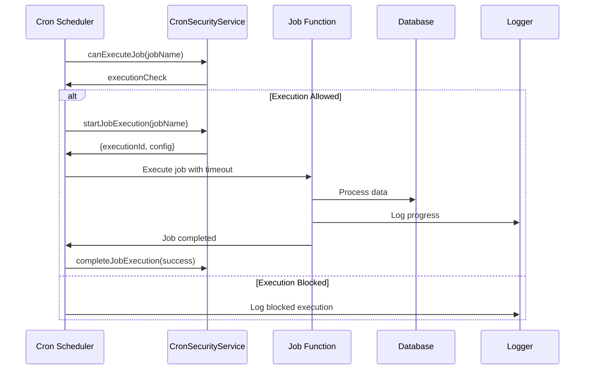

# Schedulers & Cron Jobs

## Executive Summary
- **Total Jobs**: 5 scheduled cron jobs
- **Security**: ✅ **Well-secured** with execution controls
- **Timezone Support**: ✅ **Multi-timezone** (UTC, Australia/Sydney)
- **Status**: ✅ **Production-ready** with comprehensive error handling
- **Missing**: Socket.IO broadcasting integration

## Cron Job Inventory

### 🎯 **OG Daily Bonus Job** (`ogDailyBonus.ts`)
**Status**: ✅ **Fully Implemented**
**Schedule**: `5 0 * * *` (00:05 Australia/Sydney timezone)
**Purpose**: Daily bonus payout for active OG tier subscribers
**Size**: 96 lines

**Key Features**:
- Idempotency check (prevents duplicate daily bonuses)
- Formula: `floor(priceCoins * 0.6 / durationDays)`
- Credits to `bonusBalance` only (non-spendable)
- Comprehensive transaction logging
- Error handling per user

**Business Logic**:
- Finds all active OG users (ogLevel > 0, ogExpiresAt > now)
- Calculates daily bonus based on tier pricing
- Prevents duplicate bonuses per day
- Creates audit transaction records

### 🏆 **Throne Expiry Job** (`throneExpiry.ts`)
**Status**: ✅ **Core Logic Complete**
**Schedule**: `*/5 * * * *` (Every 5 minutes UTC)
**Purpose**: Clean up expired throne competitions
**Size**: 65 lines

**Key Features**:
- Finds expired thrones using model static method
- Marks thrones as inactive
- Comprehensive error handling
- TODO: Socket.IO broadcasting

**Business Logic**:
- Uses `Throne.findExpired()` to find expired thrones
- Marks `isActive = false`
- Logs processing statistics
- **Missing**: Real-time notifications to clients

### 🎉 **Festival Activation Job** (`festivalActivation.ts`)
**Status**: ✅ **Core Logic Complete**
**Schedule**: `0 * * * *` (Every hour UTC)
**Purpose**: Activate/deactivate festivals based on dates
**Size**: 182 lines

**Key Features**:
- Automatic festival activation/deactivation
- Gift activation/deactivation
- Theme application/removal
- Comprehensive error handling
- TODO: Socket.IO broadcasting

**Business Logic**:
- Activates festivals when `startDate <= now <= endDate`
- Deactivates festivals when `endDate < now`
- Activates/deactivates associated gifts
- Applies/removes festival themes
- **Missing**: Real-time notifications and theme implementation

### 📊 **Stream Ranking Update Job** (Inline)
**Status**: ✅ **Implemented**
**Schedule**: `*/10 * * * *` (Every 10 minutes UTC)
**Purpose**: Update stream rankings and metrics
**Size**: 8 lines (inline implementation)

**Key Features**:
- Calls `rankingService.calculateAllStreamRankings()`
- Updates stream engagement scores
- Error handling and logging

### 👤 **User Trust Score Update Job** (Inline)
**Status**: ✅ **Implemented**
**Schedule**: `*/30 * * * *` (Every 30 minutes UTC)
**Purpose**: Update user trust scores based on reputation
**Size**: 13 lines (inline implementation)

**Key Features**:
- Updates trust scores for all users
- Calls `reputationService.updateUserTrustScore()`
- Batch processing with error handling

## Security Implementation

### ✅ **CronSecurityService Integration**
- Execution permission checks before job runs
- Job execution tracking with unique IDs
- Timeout protection (configurable max execution time)
- Retry logic with configurable attempts and delays
- Comprehensive logging and monitoring

### ✅ **Error Handling**
- Individual user/record error handling
- Job-level error recovery
- Retry mechanisms for failed jobs
- Comprehensive error logging
- Graceful degradation

### ✅ **Idempotency**
- OG bonus job prevents duplicate daily payouts
- Transaction-based audit trails
- Date-based idempotency checks
- Safe retry mechanisms

## Timezone Configuration

### ✅ **Multi-Timezone Support**
- **OG Daily Bonus**: Australia/Sydney timezone (00:05 local time)
- **Other Jobs**: UTC timezone for consistency
- Proper timezone handling in cron expressions
- Date calculations respect timezones

## Job Execution Flow

### Secure Job Execution Process


## Missing Implementations

### ❌ **Socket.IO Broadcasting**
**Impact**: High - Users don't get real-time notifications
**Jobs Affected**:
- Throne expiry notifications
- Festival activation/deactivation announcements
- OG bonus notifications

**Required Implementation**:
```typescript
// Example implementation needed
io.emit('throne:expired', {
  throneId: throne._id,
  streamId: throne.streamId,
  username: throne.username,
  totalCoins: throne.totalCoins
});

io.emit('festival:activated', {
  festivalId: festival._id,
  name: festival.name,
  theme: festival.theme,
  bonuses: festival.bonuses
});
```

### ❌ **Festival Theme Application**
**Impact**: Medium - Festivals don't have visual themes
**Missing Features**:
- CSS theme application
- Stream skin activation
- UI element updates
- Theme removal logic

### ❌ **Advanced Monitoring**
**Impact**: Low - Limited observability
**Missing Features**:
- Job execution metrics
- Performance monitoring
- Alerting for failed jobs
- Job duration tracking

## Performance Considerations

### ✅ **Optimized**
- Batch processing for user updates
- Efficient database queries
- Minimal memory usage
- Proper error isolation

### ⚠️ **Could Be Improved**
- Parallel processing for large datasets
- Database connection pooling
- Memory usage monitoring
- Job execution time limits

## Configuration Management

### ✅ **Well Configured**
- Timezone-aware scheduling
- Configurable execution timeouts
- Retry logic configuration
- Security service integration

### ⚠️ **Missing Configuration**
- Job-specific configuration files
- Environment-based job enabling/disabling
- Dynamic schedule modification
- Job priority management

## Monitoring & Observability

### ✅ **Implemented**
- Comprehensive logging
- Error tracking
- Execution statistics
- Job status monitoring

### ❌ **Missing**
- Metrics collection
- Performance dashboards
- Alerting system
- Job execution history

## Integration Points

### ✅ **Well Integrated**
- Database models (User, OGTier, Transaction, Throne, Festival)
- Security service (CronSecurityService)
- Logging system
- Error handling

### ⚠️ **Needs Integration**
- Socket.IO for real-time notifications
- Theme system for festivals
- Metrics collection system
- Alerting system

## Business Logic Validation

### ✅ **Correct Implementation**
- OG bonus formula: `floor(priceCoins * 0.6 / durationDays)`
- Idempotency for daily bonuses
- Proper throne expiry logic
- Festival date-based activation

### ⚠️ **Needs Validation**
- OG bonus calculation accuracy
- Throne expiry timing
- Festival gift activation logic
- Trust score calculation

## Next Steps

### **High Priority**
1. Implement Socket.IO broadcasting for all jobs
2. Add festival theme application logic
3. Implement job execution monitoring
4. Add alerting for failed jobs

### **Medium Priority**
1. Add job-specific configuration files
2. Implement parallel processing for large datasets
3. Add job execution metrics
4. Create job management dashboard

### **Low Priority**
1. Add job priority management
2. Implement dynamic schedule modification
3. Add job execution history
4. Create performance optimization tools
