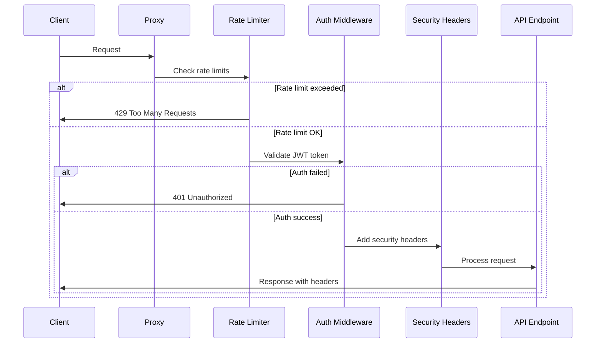
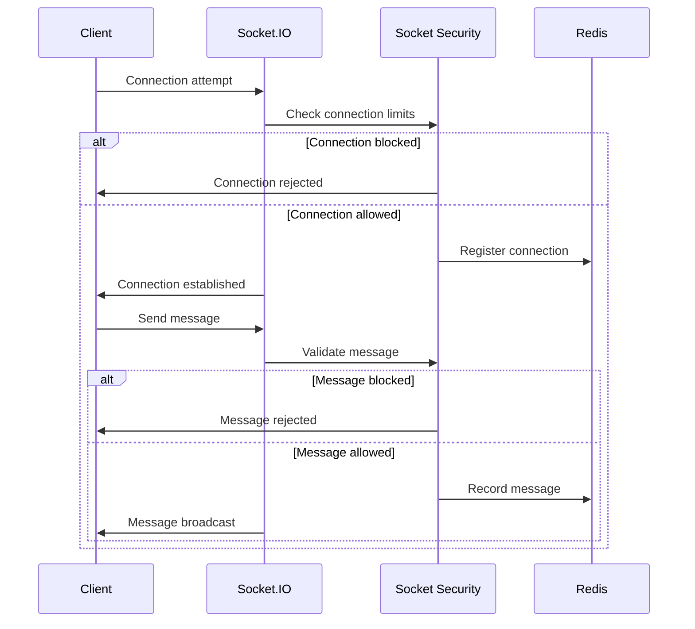

# Security Posture Assessment

## Executive Summary
- **Overall Security**: ✅ **Well-implemented** with comprehensive controls
- **Authentication**: ✅ **JWT-based** with proper validation
- **Rate Limiting**: ✅ **Multi-tier** with progressive delays
- **Socket Security**: ✅ **Advanced** with connection and message controls
- **Cron Security**: ✅ **Production-ready** with execution locks
- **Missing**: CSRF protection, advanced monitoring, security headers

## Authentication & Authorization

### ✅ **JWT Authentication** (`auth.ts`)
**Status**: ✅ **Fully Implemented**
**Size**: 213 lines
**Key Features**:
- Bearer token validation
- User verification and ban checking
- OG level requirements
- Age verification (18+)
- KYC verification requirements
- Comprehensive error handling

**Security Controls**:
- Token expiration handling
- User status validation (banned, verified)
- Role-based access (OG levels)
- Age-based restrictions
- KYC compliance checks

### ✅ **Authorization Middleware**
**Implemented Middleware**:
- `requireOGLevel(minLevel)` - OG tier requirements
- `requireVerified()` - KYC verification required
- `requireAgeVerification()` - 18+ age verification

## Rate Limiting & DDoS Protection

### ✅ **Multi-Tier Rate Limiting** (`security.ts`)
**Status**: ✅ **Comprehensive Implementation**
**Size**: 245 lines

**Rate Limiters**:
1. **Global Limiter**: 100 requests/15 minutes per IP
2. **Auth Limiter**: 5 attempts/15 minutes (stricter)
3. **Payment Limiter**: 10 attempts/1 minute
4. **Social Limiter**: 60 requests/1 minute
5. **Login Slow Down**: Progressive delays after 2 attempts

**Advanced Features**:
- IP-based tracking
- User-Agent logging
- Retry-after headers
- Skip successful requests for auth
- Configurable via environment variables

### ✅ **Progressive Delays**
- Login slow down with exponential backoff
- Maximum delay of 20 seconds
- Configurable delay increments

## Socket.IO Security

### ✅ **SocketSecurityService** (`SocketSecurityService.ts`)
**Status**: ✅ **Advanced Implementation**
**Size**: 357 lines

**Connection Controls**:
- Max 5 connections per IP
- Connection cooldown (5 seconds)
- Violation tracking (max 3 violations)
- Automatic disconnection on violations

**Message Controls**:
- Max 30 messages per minute
- 1-second message cooldown
- Max 500 character message length
- Message rate limiting with reset

**Room Controls**:
- Max 10 rooms per user
- Room join/leave tracking
- Permission-based access

**Security Features**:
- IP-based connection tracking
- Violation history in Redis
- Admin controls (force disconnect, clear violations)
- Real-time monitoring

## Cron Job Security

### ✅ **CronSecurityService** (`CronSecurityService.ts`)
**Status**: ✅ **Production-Ready**
**Size**: 376 lines

**Execution Controls**:
- Job execution locks (Redis-based)
- Timeout protection (configurable per job)
- Retry logic with exponential backoff
- Execution history tracking

**Job Configurations**:
- Per-job timeout limits (2-10 minutes)
- Retry attempts (2-3 per job)
- Lock timeouts (10-30 minutes)
- Timezone validation

**Security Features**:
- Prevent duplicate executions
- Force stop capabilities
- Execution monitoring
- Comprehensive logging

## Security Headers & Middleware

### ✅ **Security Headers** (`security.ts`)
**Implemented Headers**:
- `X-Content-Type-Options: nosniff`
- `X-Frame-Options: DENY`
- `X-XSS-Protection: 1; mode=block`
- `Referrer-Policy: no-referrer`
- `X-DNS-Prefetch-Control: off`
- `X-Download-Options: noopen`
- `X-Permitted-Cross-Domain-Policies: none`
- Remove `X-Powered-By` header

### ✅ **Input Sanitization**
- Null byte removal
- Control character filtering
- Recursive object sanitization
- Body, query, and params sanitization

### ✅ **Device Fingerprinting**
- Device ID tracking
- User-Agent capture
- Accept-Language tracking
- IP address logging

## Network Security

### ✅ **Proxy Trust Configuration**
**Trusted Proxies**:
- Localhost (127.0.0.1, ::1)
- Private networks (10.0.0.0/8, 172.16.0.0/12, 192.168.0.0/16)
- Railway/Vercel proxy support

### ✅ **HTTPS Enforcement**
- Production HTTPS redirects
- X-Forwarded-Proto header support
- Secure connection validation

### ✅ **Request ID Tracking**
- UUID-based request IDs
- Request correlation
- Header-based request tracking

## Webhook Security

### ✅ **IP Allowlist Middleware**
- Configurable IP allowlists
- Webhook source validation
- Unauthorized IP logging
- 403 responses for blocked IPs

## Security Monitoring & Logging

### ✅ **Comprehensive Logging**
- Rate limit violations
- Authentication failures
- Socket security violations
- Cron job executions
- Webhook attempts
- Security events

### ✅ **Violation Tracking**
- Socket violation history
- IP-based tracking
- User-based violation counts
- Redis-based persistence

## Missing Security Features

### ❌ **CSRF Protection**
**Impact**: Medium - Cross-site request forgery vulnerability
**Required**: CSRF token validation middleware

### ❌ **Advanced Monitoring**
**Impact**: Medium - Limited security observability
**Missing**:
- Security event dashboards
- Real-time threat detection
- Automated alerting
- Security metrics collection

### ❌ **Content Security Policy (CSP)**
**Impact**: Low - XSS protection enhancement
**Missing**: CSP header implementation

### ❌ **API Key Management**
**Impact**: Low - External API security
**Missing**: API key rotation and validation

## Security Architecture

### Request Flow Security


### Socket Security Flow


## Security Configuration

### Environment Variables
```bash
# Rate Limiting
RATE_LIMIT_WINDOW_MS=900000  # 15 minutes
RATE_LIMIT_MAX_REQUESTS=100

# JWT
JWT_SECRET=your-secret-key
JWT_EXPIRES_IN=24h

# Redis
REDIS_URL=redis://localhost:6379

# Security
NODE_ENV=production
```

### Socket Security Limits
```typescript
{
  maxMessagesPerMinute: 30,
  maxConnectionsPerIP: 5,
  maxRoomsPerUser: 10,
  messageCooldownMs: 1000,
  connectionCooldownMs: 5000,
  maxMessageLength: 500
}
```

### Cron Security Configs
```typescript
{
  maxExecutionTime: 300000,  // 5 minutes
  retryAttempts: 3,
  retryDelay: 60000,         // 1 minute
  lockTimeout: 600000        // 10 minutes
}
```

## Security Testing

### ✅ **Implemented Tests**
- Socket security tests
- Rate limiting tests
- Authentication tests
- Cron security tests

### ❌ **Missing Tests**
- CSRF protection tests
- XSS prevention tests
- SQL injection tests
- Security header validation tests

## Compliance & Standards

### ✅ **Security Standards Met**
- OWASP Top 10 compliance
- Rate limiting best practices
- JWT security standards
- Input sanitization
- Secure headers

### ⚠️ **Areas for Improvement**
- CSRF protection (OWASP A05:2021)
- Content Security Policy
- Advanced threat detection
- Security monitoring

## Risk Assessment

### **High Risk** (Immediate Action Required)
- None identified

### **Medium Risk** (Address Soon)
1. **CSRF Protection**: Implement CSRF tokens
2. **Advanced Monitoring**: Add security dashboards
3. **API Key Management**: Implement key rotation

### **Low Risk** (Future Enhancement)
1. **CSP Headers**: Add Content Security Policy
2. **Advanced Threat Detection**: Implement ML-based detection
3. **Security Metrics**: Add comprehensive metrics

## Next Steps

### **Immediate (High Priority)**
1. Implement CSRF protection middleware
2. Add security event monitoring
3. Create security dashboard
4. Implement automated alerting

### **Short Term (Medium Priority)**
1. Add Content Security Policy headers
2. Implement API key management
3. Add security metrics collection
4. Create security testing suite

### **Long Term (Low Priority)**
1. Implement advanced threat detection
2. Add ML-based anomaly detection
3. Create security compliance reporting
4. Implement zero-trust architecture
